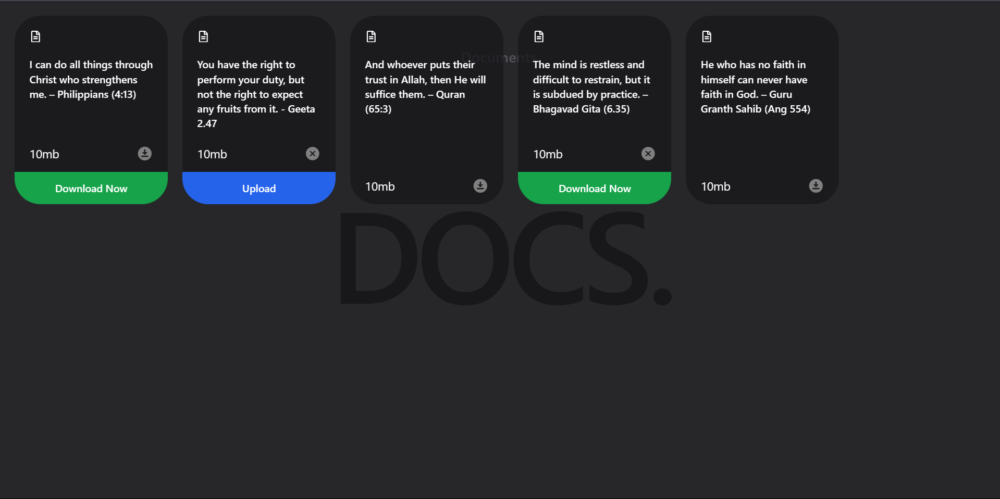
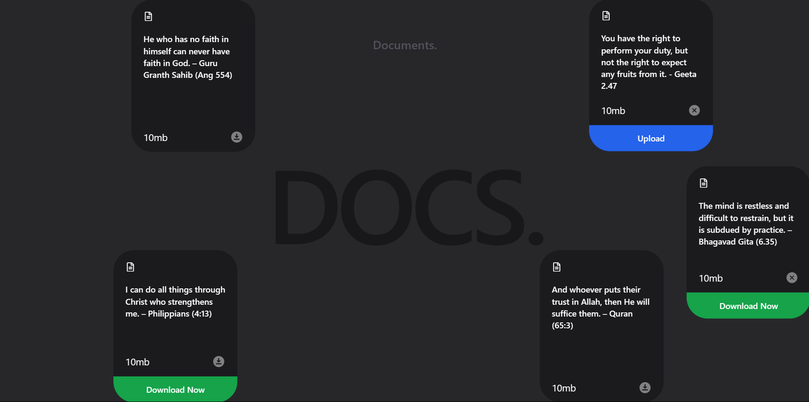

# Draggable Card




## Overview
**Draggable Card** is a React-based web application that allows users to create, view, and rearrange cards by dragging and dropping them. This project showcases the use of modern web development practices, including responsive design and user interaction through drag-and-drop functionality.

## Features
- **Drag and Drop**: Easily move cards around the interface to organize them as desired.
- **Responsive Design**: The application is fully responsive and works seamlessly on various devices.
- **Customizable Cards**: Users can add their content and customize the appearance of each card.

## Technologies Used
- **React**: A JavaScript library for building user interfaces.
- **HTML/CSS**: For structuring and styling the application.
- **Vite**: A fast build tool for modern web projects.

## Installation
To get started with the Draggable Card project, follow these steps:

 **Clone the Repository**:
   ```bash
   git clone https://github.com/jaykumar2526/Draggable-Card.git


